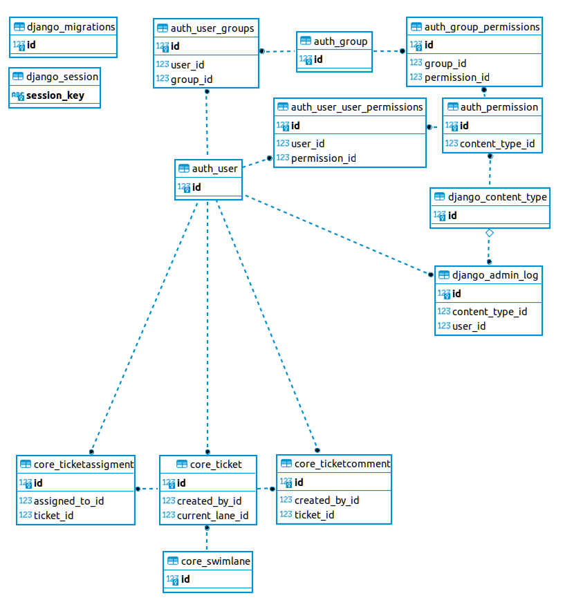

# How to

## Installation

1. Install `poetry`:
   - As python user package:
     ```bash
     pip install --user poetry
     $HOME/.local/bin/poetry -V
     ```

   - or in a virtual env:
     ```bash
     python -m venv .venv
     source .venv/bin/activate
     pip install poetry
     poetry -V
     ```
2. Install dependencies:
   ```bash
   poetry install --with=dev
   ```

If you decided to install in a virtual environment please be aware that you have
to activate that environment before running any commands that are described next
like this:

```bash
source .venv/bin/activate
```

## Running

### Preparation before first run

1. Activate poetry environment:
   ```bash
   poetry shell
   ```
2. Collect static files:
   ```bash
   python manage.py collectstatic
   ```
3. Create the SQLite database:
   ```bash
   python manage.py migrate
   ```
4. Create a superuser:
   ```bash
   python manage.py createsuperuser
   ```

### Starting the dev server

If you changed model definitions or added new models or data-migrations please
run a migration before running the dev server:

```bash
python manage.py migrate
```

To run the dev server just call the `runserver` command:

```bash
python manage.py runserver
```

The console will give you log output and if you change program code it will
reload the running server process. You can reach the development server at
http://127.0.0.1:8000 as is displayed in the log output.

Find the Admin interface under http://127.0.0.1:8000/admin/ . You can only
log into the admin interface if your user has the `is_staff` attribute set.
You can only edit data in the admin interface if the user has `is_superuser` or
the correct model permissions.

## Walkthrough

You will see two main folders, one is a django application and one is the
project which contains all configuration and ties apps together.

### Dependency management

All dependencies are managed by poetry in this project, so to add new
dependencies or update versions all is done via the `poetry` command.

- Just run `poetry add <name>` to add a new dependency.
- Run `poetry update` to update all dependecies to their cross compatible most
  up to date versions. If this is successful poetry saves this configuration to
  `poetry.lock` for you to be able to reproduce an installation later.
- Dependencies are saved in `pyproject.toml`, be careful if you edit this by hand

### django_starter

This is the project folder, here you will find URL configuration and settings,
as well as the `wsgi` starter module.

Most interesting here are:

- `settings.py`, this contains all global settings.
- `urls.py`, this defines the URL routing for your views. Many django apps have
  their own `urls.py` in the application tree, so usually you will include those
  like the `api_urls.py` is included here.

### core

This is the application, a project may combine multiple applications, but we
only have one right here.

You will find multiple python modules in here:

- `admin`: This contains the code that is used to display the django admin
  interface. Usually all models are defined to be managed in the admin interface
  to avoid having to use a DB client to manage data.
- `management`: This contains additional commands to be registered with
  `manage.py` for administrative reasons. Usually you will find one-off commands
  and example factories as well as deployment utilities in here. If you call
  `manage.py` without a command you will get a list with available management
  commands and all commands have at least the `--help` commandline switch.
- `middleware`: this contains middleware that will be run for all requests
- `migrations`: This contains the DB migration scripts that are either generated
  automatically by django or written by hand to modify data.
- `models`: This contains all models defined in the application
- `serializers`: This contains API serializers to convert from and to JSON or
  XML on the API frontend
- `views`: This contains views that are available to a user of the application,
  in our case here they are just API endpoints, but they can contain generated
  HTML from the templating engine or any other data.
- `api_urls.py`: This registers all views with the routing framework and will be
  imported in the project's `urls.py`

## Details: Models

The application is a simple Kanban board which contains 4 Models and uses the
default user model of django.



The models are:

### `Swimlane`: The swimlane definition

by default the data migration in `core/migrations/0002_prefill_swimlanes.py`
creates 5 lanes:

- Backlog
- To Do
- In Progress
- To Test
- Done

### `Ticket`: The ticket definition

Interesting things to note here:

- We have a foreign key to `Swimlane` which creates a `tickets` attribute
  remotely. So you can get a list of tickets of a swimlane by fetching the
  `tickets` query set of a swimlane object. Be aware of the `PROTECT` setting
  on the foreign key. You can not delete a swimlane that contains tickets as
  the tickets would be in no lane and orphaned. By default django does not allow
  `NULL` values.
- `created_at` and `updated_at` dates will update automatically (on creation
  and update respectively)
- the foreign key to the default user model of django is set to `PROTECT`, so
  you will not be able to delete a user that still has tickets assigned.
- The `__str__` function is overridden to display a readable description in the
  admin interface, if that is not defined you will get something like `Ticket(1)`
  which is not that helpful.

### `TicketAssignment`: Who is assigned to a ticket

Interesting things to note here:

- The foreign key to `Ticket` creates a back reference in the ticket class named
  `assignments`, so you can query all assignments easily as an attribute of the
  ticket object. In addition the delete mode is set to `CASCADE` which means all
  assignments are automatically deleted when the parent ticket is deleted.
- The `Meta` class defines a DB constraint: All assignments have to be unique,
  it makes no sense to add multiple `ticket <-> user` entries, so we define
  those two attributes as `unique_together`

### `TicketComment`: Comments on a ticket

Interesting things to note here:

- The `comment` field is defined as `blank=True` so the django admin allows
  an empty comment, if that would be left out you'd have to fill in the text-
  field

## Details: Serializers and views

To demonstrate we're using `HyperlinkedModelSerializer`s here. This just means
that all references to other objects are in the form of a hyperlink. We do this
here to be able to just click the links to navigate the API. There are other
serializers that will cascade serialize objects or just object IDs.

As you can see in the `TicketSerializer` it is possible to include references to
other models that have foreign keys and registered attributes to the object like
`comments` and `assignments`.

The views in use here are just boilerplate. If you're using pagination you'll
have to define a sort order though.

## Changing models

If you make changes to a model be aware that you have to create a migration
script for django to change the DB structure like this:

```bash
python manage.py makemigrations
```

This will render the model tree and detect any changes you made to automatically
create a new migration script. If you run this when no changes are made it just
displays that it has no changes detected and exits.


Example output for a change detected:

```
Migrations for 'core':
  core/migrations/0003_swimlane_priority.py
    - Add field priority to swimlane
```

Example output if nothing has changed:

```
No changes detected
```

If you start a project where the DB is out of sync with the model tree this
happens:

```
❯  python manage.py runserver
Watching for file changes with StatReloader
Performing system checks...

System check identified no issues (0 silenced).

You have 1 unapplied migration(s). Your project may not work properly until you apply the migrations for app(s): core.
Run 'python manage.py migrate' to apply them.
```

**Be aware**: the application running in this state is probably unstable.

## Data migrations

If you have to change data in the DB you can create a so called data migration:

```bash
python manage.py makemigrations --empty <appname>
```

this will result in an empty migration file that looks something like this:

```python
from django.db import migrations


class Migration(migrations.Migration):
    dependencies = [
        ("core", "0003_swimlane_priority"),
    ]

    operations = []
```

You can then create a python function to migrate data.

**Attention**: Do not include a model via `import` as you will break migrations
that are based on prior versions of that model.

See `core/migrations/0002_prefill_swimlanes.py` on how to get model classes to
be used in migrations.